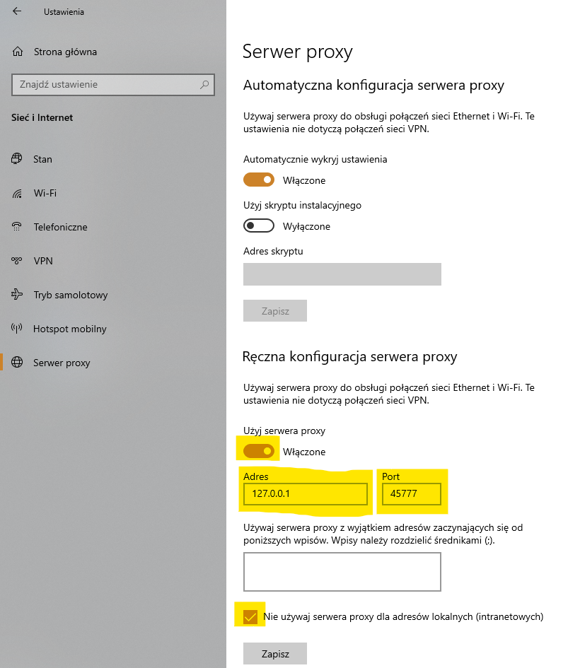

# Lukas-Anti-Censorship-Proxy

Krótka nazwa: **lacp**. Lokalny, przezroczysty proxy HTTP CONNECT + SOCKS5.
**Działa na Twoim komputerze i nie odszyfrowuje TLS.**

## Do czego to jest?

Do omijania filtrów cenzury (na przykład brytyjskich). Dzięki temu wejdziesz
na strony zablokowane przez rząd **bez VPN-a**.

## Czy trudno to skonfigurować?

Nie, zajmuje to około minuty. Uruchamiasz program i zmieniasz dwie rzeczy
w ustawieniach sieci Windows.

1. Uruchom program (`lacp.exe`). Powinno pojawić się okno konsoli. Zminimalizuj
   je i zostaw w spokoju.
2. Wejdź w Ustawienia Windows → Sieć i Internet → Serwer proxy (po lewej).
3. W sekcji „Ręczna konfiguracja serwera proxy” włącz proxy przełącznikiem
   „Użyj serwera proxy”.
4. Wypełnij te dwa pola tak jak na obrazku poniżej:
   
5. Opcjonalnie zaznacz „Nie używaj serwera proxy dla adresów lokalnych (intranet)”.
6. Może być też potrzebna zmiana serwerów DNS w Windows na nieocenzurowane.

   Spróbuj:
   - https://blog.uncensoreddns.org
   - https://dns.watch

   Albo DNS-y wielkich firm:
   - [Cloudflare](https://pl.wikipedia.org/wiki/1.1.1.1)
   - [Google DNS](https://developers.google.com/speed/public-dns?hl=pl)

## Jak to dokładnie działa?

Przy handshake’u dzieli rekord `ClientHello` na dwa, tak że
**pierwszy rekord TLS i pierwszy pakiet TCP nie zawierają SNI**
(rozszerzenia `server_name`). Serwer składa oryginalny `ClientHello` w
całości — transkrypt TLS zostaje nienaruszony, strony działają.

> Usunięcie SNI z `ClientHello` **psuje HTTPS**. To pole jest hashowane w
> transkrypcie TLS 1.2/1.3; klient i serwer liczą wtedy różne sumy i
> handshake pada (`bad record MAC`). Narzędzie **chowa** SNI przed prostym
> DPI; nie wycina go z wiadomości handshake’u.

Dokumentacja po angielsku: [README.md](README.md).

## Szybki start

### 1. Pobierz gotowe binarum (Windows / macOS)

Po wrzuceniu repozytorium na GitHub każdy commit na `master` robi Release:

`https://github.com/<user>/<repo>/releases/latest`

| Plik | System |
| --- | --- |
| `lacp-windows-amd64.exe` | Windows 64-bit (typowy PC) |
| `lacp-windows-arm64.exe` | Windows ARM64 |
| `lacp-darwin-amd64` | macOS Intel |
| `lacp-darwin-arm64` | macOS Apple Silicon (M1+) |
| `lacp-source.zip` | Linux i własna kompilacja |

### 2. Uruchom i **zostaw okno otwarte**

Windows (PowerShell) — prefiks `.\` jest obowiązkowy:

```powershell
.\lacp-windows-amd64.exe
```

albo po lokalnej kompilacji:

```powershell
.\lacp.exe
```

macOS / Linux:

```bash
chmod +x lacp-darwin-arm64
./lacp-darwin-arm64
```

Sukces wygląda tak (proces **nie** wraca do promptu):

```
Lukas-Anti-Censorship-Proxy (lacp) master-a1b2c3d (commit a1b2c3d4e5f6…)
listening on 127.0.0.1:45777
Vivaldi/Chrome shortcut: --proxy-server=http://127.0.0.1:45777
SOCKS5 (same port):      --proxy-server=socks5://127.0.0.1:45777
```

`go build` / `make` **nie** startuje serwera — tylko kompiluje. To, że
komenda kończy się natychmiast i bez błędu, jest normalne.

## Konfiguracja (`lacp.json`)

Ustawienia są w **`lacp.json`** obok `lacp.exe` (albo w katalogu roboczym).
Przy pierwszym starcie, jeśli pliku nie ma, lacp zapisuje domyślny — edytujesz
go i restartujesz program.

```json
{
  "host": "127.0.0.1",
  "port": 45777,
  "timeout": "15s",
  "gap": "10ms",
  "quiet": false
}
```

| Klucz | Domyślnie | Znaczenie |
| --- | --- | --- |
| `host` | `127.0.0.1` | Adres nasłuchu. Zostaw loopback; `0.0.0.0` zrobi z tego open proxy. |
| `port` | `45777` | Port TCP — musi być ten sam co w ustawieniach proxy. |
| `timeout` | `15s` | Timeout połączenia wychodzącego (dial). Format Go (`15s`, `1m`, …). |
| `gap` | `10ms` | Przerwa między dwoma fragmentami ClientHello, żeby stos TCP nie skleił ich w jeden pakiet. |
| `quiet` | `false` | `true` wyłącza logi per-połączenie. |

Zmień `"port": 45777` na dowolny inny, zapisz, zrestartuj lacp i w ustawieniach
proxy Windows / Vivaldi / Chrome ustaw ten sam port
(`--proxy-server=http://127.0.0.1:PORT`).

Flagi wiersza poleceń nadpisują plik tylko wtedy, gdy je podasz (reszta
zostaje taka jak w JSON-ie):

```powershell
.\lacp.exe -config .\lacp.json -port 9999
```

| Flaga | Znaczenie |
| --- | --- |
| `-config` | Ścieżka do JSON-a (domyślnie: automatyczne szukanie `lacp.json`) |
| `-host` | Nadpisz `host` |
| `-port` | Nadpisz `port` |
| `-timeout` | Nadpisz `timeout` |
| `-gap` | Nadpisz `gap` |
| `-quiet` | Nadpisz `quiet` |

Ctrl+C zatrzymuje serwer.

## Jak to działa (krótko)

1. Przeglądarka robi `CONNECT example.com:443` (HTTPS) albo SOCKS5 CONNECT.
2. Proxy łączy się z celem i oddaje `200 Connection Established`.
3. Czyta pierwszy rekord TLS. Jeśli to `ClientHello` z rozszerzeniem SNI:
   - tnie wiadomość handshake **na granicy tego rozszerzenia**,
   - owija obie części w osobne rekordy TLS (dozwolona fragmentacja z
     RFC 5246 / 8446 — transkrypt haszuje złożoną wiadomość, nie rekordy),
   - wysyła rekord 1, czeka `-gap`, wysyła rekord 2 (`TCP_NODELAY`).
4. Reszta bajtów w obie strony idzie bez zmian (splice).

DPI, które patrzy tylko na pierwszy rekord / pierwszy pakiet, nie widzi
nazwy hosta. Serwer docelowy po złożeniu rekordów **dostaje SNI** —
wirtualny hosting i certyfikat CDN działają.

## Czego to nie robi

- Nie jest VPN-em. **IP celu nadal widać.**
- Nie wygra z DPI, które składa cały strumień TCP i czyta drugi rekord.
- Nie obchodzi blokad opartych o IP.
- HTTP/3 (QUIC) często omija proxy HTTP; Chrome/Vivaldi przy ustawionym
  proxy zwykle spadają na HTTP/2.
- Nie instaluje certyfikatu i nie robi MITM.

## Dokumentacja

| Dokument | Temat |
| --- | --- |
| [README.md](README.md) | Angielska wersja tego opisu |
| [docs/BUILD.md](docs/BUILD.md) | Budowa ze źródeł, `GOOS`/`GOARCH`, testy, rozwiązywanie problemów |
| [docs/RELEASES.md](docs/RELEASES.md) | GitHub Actions: każdy commit na `master` = nowy release |
| [`.github/workflows/release.yml`](.github/workflows/release.yml) | Sam pipeline, krok po kroku, z komentarzami |

## Kompilacja w jednym zdaniu

```bash
go test ./... && go build -ldflags="-s -w" -o lacp .
```

Na Windowsie powstaje `lacp.exe`. Szczegóły, kompilacja krzyżowa, Makefile:
[docs/BUILD.md](docs/BUILD.md).

## Wymagania deweloperskie

- Go 1.22+
- Zero zależności spoza biblioteki standardowej Go (`go.mod` nie ma `require`)

## Licencja

Kod jest udostępniany „tak jak jest”, bez gwarancji. Używasz na własną
odpowiedzialność. Narzędzie jest do prywatności własnego ruchu, nie do
łamania zabezpieczeń cudzych systemów.
